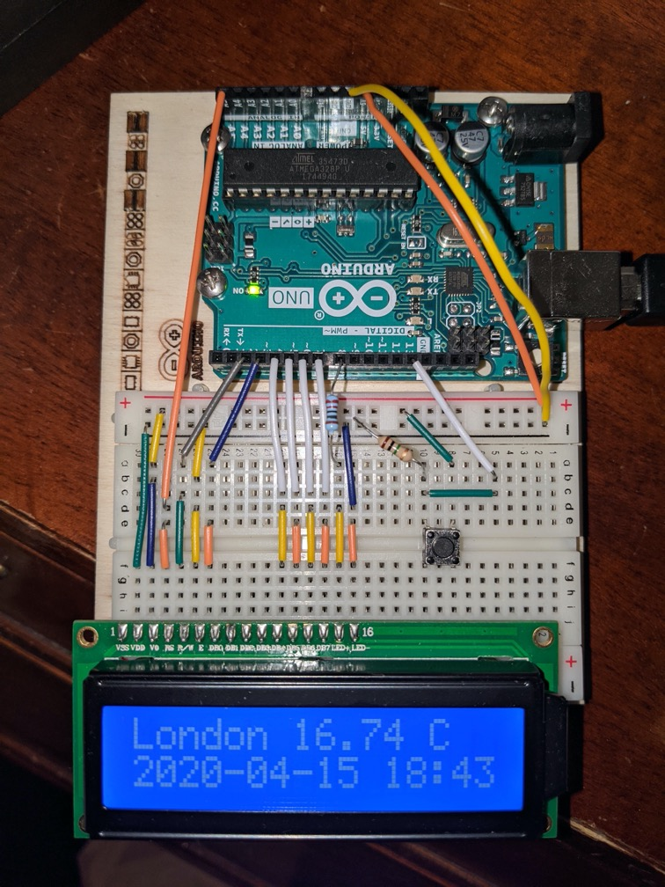

# Arduino weather

Weather application that can show multiple locations with the current temperature
for Arduino devices with connected LCD display.

The tool consists of a part that runs on the Arduino and another part that can run on any
system that supports Python 3.7+

Required libraries:
* [LiquidCrystal](https://www.arduino.cc/en/Reference/LiquidCrystal)
* [ArduinoJson](https://arduinojson.org/)
* [arduino-timer](https://github.com/contrem/arduino-timer)

## Setup

Setup the wiring like below. More images and be found in the `images` folder.



The `weather.cpp` needs to be loaded onto the Arduino, before the Python script can communicate with
with it. You may need to adjust it to your configuration.

## Usage

### Arduino

Using arduino-cli

```sh
arduino-cli lib install LiquidCrystal ArduinoJson arduino-timer
arduino-cli compile -b arduino:avr:uno .
arduino-cli upload -p $SERIAL_DEVICE --fqbn arduino:avr:uno .
```

### Serial host

```sh
poetry run python -m arduino_weather
```

Environment variables:

* `OWM_API_KEY` required, [OpenWeatherMap](https://home.openweathermap.org/) API key
* `LOCATIONS` required, weather from locations to be shown, needs to be specified in the following format:
  `London,GB;Zurich,CH;Munich,DE`
* `TIMEZONE` optional, defaults to `Europe/Zurich`
* `SERIAL_DEVICE` optional, The port of your Arduino serial device, defaults to `/dev/cu.usbmodem14301`
* `DRY_MODE` optional, just show weather data without LCD connected, defaults to `False`

### Systemd entry

To start this as a service, you can use this example systemd config:

```ini
[Unit]
Description=Arduino Weather service
After=network.target

[Service]
User=arduino-weather
ExecStart=/usr/local/bin/poetry run python -m arduino_weather
WorkingDirectory=/opt/arduino-weather
Environment="SERIAL_DEVICE=/dev/ttyACM0"
Environment="OWM_API_KEY=<example-key>"
Environment="LOCATIONS=London,GB;Zurich,CH;Munich,DE"
Restart=always
RestartSec=3

[Install]
WantedBy=default.target
```
